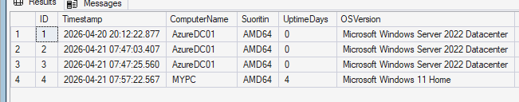
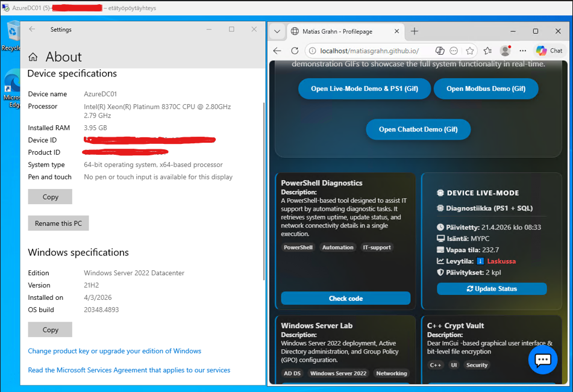

# Azure-Hybrid-Cloud-Integration-SQL-Data-Pipeline

## Project Overview
This project documents the implementation of a secure Hybrid Cloud Infrastructure that connects on-premises data sources to an Azure cloud environment. The core of the project is a real-time data pipeline where local system diagnostics and industrial Modbus sensor data are securely transmitted to an Azure-hosted virtual machine for live visualization.

## System Architecture
 * Local Environment (Edge): A Python-based Modbus TCP/IP logger (simulating industrial sensors) and a PowerShell diagnostic tool.
 * Security Layer: A secure Point-to-Site (P2S) VPN tunnel bridging the local workstation and the Azure Virtual Network (VNet).
 * Cloud Operations: An Azure Virtual Machine running Windows Server 2022, hosting a SQL Server Express database.
 * API & Presentation: A Node.js REST API that fetches data from the database and serves it to a dynamic web portfolio.

## Key Features and Implementations
1. Secure Hybrid Connectivity
Unlike standard cloud-only projects, this implementation utilizes a dedicated VPN tunnel. All database and API traffic travels through a private internal IP range (10.0.0.4), ensuring that sensitive operational data is never exposed to the public internet.

2. Multi-Stream Data Pipeline
   * Industrial Data (OT): The Python logger acts as a gateway, translating Modbus register data into SQL queries.
   * System Diagnostics (IT): The PowerShell script automates the monitoring of system resources (CPU, RAM, Disk usage) and stores them in the cloud.
     
3.  Infrastructure Hardening
Security was implemented across multiple layers:
   * Azure Level: Network Security Group (NSG) rules configured to allow only essential inbound traffic.
   * OS Level: Windows Defender Firewall rules specifically for SQL (1433) and API (3000) ports.
   * Application Level: SQL Server Authentication and CORS management in the Node.js backend.

## Visual Documentation
Screenshot of succesfully Virtualmachine and Local pc communicating with the database

Screenshot of Virtual machine side of a working "live status" window on portfolio page, fetching data from SQL database and trasporting it via backend

Screenshot of a local machine opening this virtually hosted website with working features.
[IP](./IPkuva.png)
